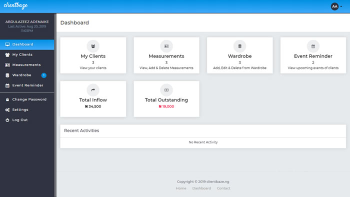

# Fashion Management Application
ClientBaze is a fashion web application, which a fashion design can use to manage is client and delivery progress.

## Dashboard Page

### Features
- User can sign up.
- User can sign in.
- User can register client measurement
- User can keep track of clients package progress.
- User can keep clients bio data.
- User (Admin) can assign role to user.
- User can keep client's event date.
- User (Admin) can keep track of client's payment.
- User can keep track of client's package delivery.

## Technologies
Project is created with:
* Bootstrap 3
* Php
* mySQL
* Javascript
